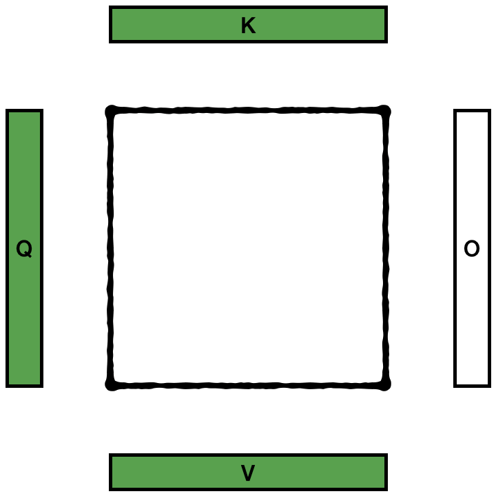

# Flash attention animation

I was trying to exactly understand how Flash attention operates.

This was the image from the [flash attention Github page](https://github.com/Dao-AILab/flash-attention/).

Here is a comparison between what I think is default implementation of attention

and the implementation of flash attention

I will comment more when after I confirm correctness.

The animation was done manually on MacOS Keynote.
